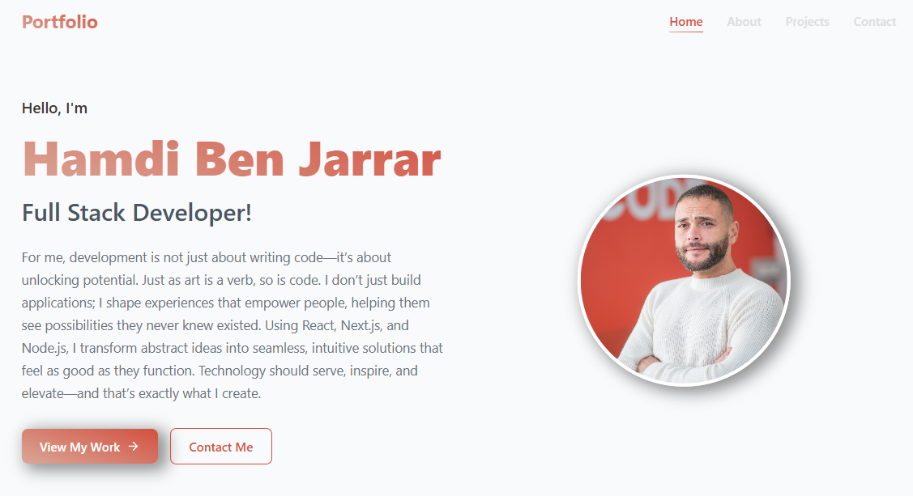

🚀 Hamdi Ben Jarrar - Portfolio

Welcome to my personal portfolio! This website showcases my skills, experience, and projects, offering a sleek and modern interface built with cutting-edge technologies.

🌍 Live Preview

🚧 Coming Soon! Stay tuned for the live deployment.

🎯 Features

✅ Modern UI/UX with smooth animations and transitions✅ Optimized Performance using Next.js for speed and efficiency✅ Fully Responsive across all devices and screen sizes✅ Styled with Styled Components & MUI for a professional look✅ Dynamic & Interactive sections for seamless user experience✅ SEO-Friendly structure for better visibility

🛠️ Tech Stack

Frontend: Next.js, React, Styled Components, MUI, Framer Motion

Backend (in progress): Node.js, Express.js

Design & UI: Aceternity UI for enhanced visuals

Deployment: Vercel, Netlify (planned)

Development Tools: TypeScript, JavaScript, Git, npm

🏗️ Installation & Setup

To run this project locally, follow these steps:

# Clone the repository
git clone https://github.com/hamdibenjarrar/portfolio.git

# Navigate into the project
cd portfolio

# Install dependencies
npm install

# Start the development server
npm run dev

📂 Project Structure

portfolio/
├── public/            # Static assets (images, icons, videos)
├── pages/             # Next.js pages
├── components/        # Reusable UI components
├── styles/            # Global styles & themes
├── hooks/             # Custom React hooks
├── lib/               # Utility functions
├── .next/             # Next.js build output (generated)
├── node_modules/      # Dependencies (auto-generated)
├── README.md          # Project documentation
├── package.json       # Project metadata
└── next.config.js     # Next.js configuration

📌 Deployment

This portfolio is designed to be hosted on Vercel for seamless integration and optimized performance. Alternative deployment options include Netlify or custom hosting providers.

🤝 Connect with Me

📌 GitHub: hamdibenjarrar💼 LinkedIn: linkedin.com/in/hamdibenjarrar📷 Instagram: @hamdibenjarrar

📜 License

This project is open-source and licensed under the MIT License.

🚀 Built with passion by Hamdi Ben Jarrar ✨

